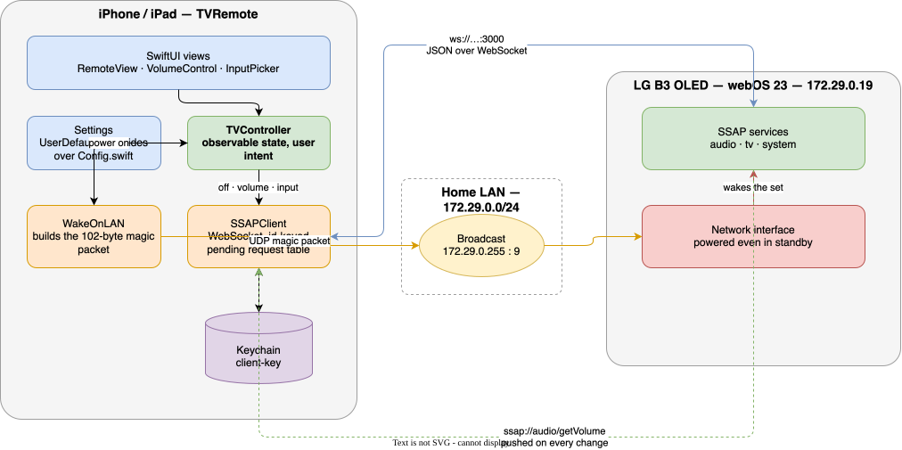

# tv-remote — an iPhone and iPad remote for an LG webOS television

## Support

If you find this useful, please consider buying me a coffee:

[](https://www.paypal.com/donate?hosted_button_id=Q3BESC73EWVNN&custom=tv-remote)

## Table of Contents

<!-- toc -->

- [Architecture Diagram](#architecture-diagram)
- [What it does](#what-it-does)
- [How it talks to the television](#how-it-talks-to-the-television)
  * [Wake-on-LAN, for switching on](#wake-on-lan-for-switching-on)
  * [SSAP, for everything else](#ssap-for-everything-else)
  * [Pairing](#pairing)
- [Repository layout](#repository-layout)
- [Configuration](#configuration)
- [Building](#building)
- [Setting up the TV](#setting-up-the-tv)
- [Poking the TV by hand](#poking-the-tv-by-hand)
- [Testing](#testing)
- [Architecture Diagrams](#architecture-diagrams)
- [Support](#support)

<!-- tocstop -->

## Architecture Diagram



## What it does

A small SwiftUI app that turns an LG OLED on and off, changes the volume, and
switches between HDMI inputs. It talks to the television directly over the
local network — there is no cloud service, no account, and nothing leaves the
LAN.

Built against an **LG B3 OLED running webOS 23**, but nothing in it is specific
to that model beyond the defaults in `TVRemote/App/Config.swift`.

## How it talks to the television

Two protocols, because turning a television *on* and controlling one that is
already on are genuinely different problems.

### Wake-on-LAN, for switching on

A television in standby has no IP stack running. There is no socket to connect
to and no address to connect to it at, so no amount of cleverness at the
application layer will wake it. What *is* still powered is the network
interface itself, which watches every frame that reaches it for a **magic
packet**: six `0xFF` bytes followed by the interface's own MAC address repeated
sixteen times. Recognising that pattern is what brings the set up.

Because the TV has no address to be sent to, the packet is broadcast to the
subnet. `WakeOnLAN.swift` sends it to both the subnet broadcast address and the
global one, on ports 9 and 7, since firmware and routers disagree about which
combination they honour.

This needs **Mobile TV On** enabled on the television — see [Setting up the
TV](#setting-up-the-tv).

### SSAP, for everything else

Once awake, the TV listens on port 3000 for **SSAP** (Simple Service Access
Protocol), a JSON-over-WebSocket protocol. Messages carry a `type`, a
caller-chosen `id`, a `uri` naming the service, and an optional `payload`; the
TV replies asynchronously quoting the same `id`. `SSAPClient.swift` keeps a
table of in-flight requests keyed by that id so replies can be matched to
whoever is waiting for them.

The commands used are:

| Purpose | URI |
| --- | --- |
| Power off | `ssap://system/turnOff` |
| Volume up / down | `ssap://audio/volumeUp`, `ssap://audio/volumeDown` |
| Set volume | `ssap://audio/setVolume` |
| Mute | `ssap://audio/setMute` |
| Watch the volume | `ssap://audio/getVolume` (subscription) |
| List inputs | `ssap://tv/getExternalInputList` |
| Switch input | `ssap://tv/switchInput` |
| Current input | `ssap://com.webos.applicationManager/getForegroundAppInfo` |

Volume is a **subscription** rather than a poll: the TV pushes an update
whenever the level changes, so the slider stays right even when someone uses
the physical remote.

### Pairing

The TV will not accept commands from an unregistered client. The first
connection sends a manifest of requested permissions, the TV puts an "allow
this device?" prompt on screen, and once it is accepted with the physical
remote the TV returns a `client-key`. That key is kept in the iOS keychain and
presented on every subsequent connection, which is what stops the prompt
appearing every time. *Forget pairing* in Settings deletes it.

## Repository layout

```
TVRemote/
  App/         Entry point and Config.swift — every deployment-specific value
  Model/       TVInput, ConnectionState, Settings (UserDefaults overrides)
  Services/    WakeOnLAN, SSAPClient, SSAPHandshake, KeychainStore, TVController
  Views/       SwiftUI screens
  Resources/   Info.plist and the asset catalogue
TVRemoteTests/ Swift Testing unit tests
scripts/       probe.py — a development aid for poking the TV by hand
project.yml    XcodeGen spec; the .xcodeproj is generated, not committed
```

## Configuration

Everything deployment-specific lives in **`TVRemote/App/Config.swift`**:

```swift
static let defaultHost      = "172.29.0.19"        // DHCP reservation on the router
static let defaultMAC       = "20:28:bc:bb:5d:60"  // target of the magic packet
static let defaultBroadcast = "172.29.0.255"       // where the magic packet is sent
static let defaultUseTLS    = false                // ws://:3000 vs wss://:3001
```

Each is also overridable at runtime from the app's Settings screen, so a
temporary change does not need a rebuild. Clearing a field restores the
compiled-in default rather than leaving it empty.

To find the MAC of a TV that is currently awake:

```sh
ping -c1 172.29.0.19 && arp -n 172.29.0.19
```

## Building

The `.xcodeproj` is generated by [XcodeGen](https://github.com/yonaskolb/XcodeGen)
from `project.yml` and is deliberately not committed:

```sh
brew install xcodegen
xcodegen generate
open TVRemote.xcodeproj
```

Then pick your iPhone or iPad and run. Signing is automatic against team
`62YFUFBSFX`.

From the command line:

```sh
xcodebuild build -project TVRemote.xcodeproj -scheme TVRemote \
  -destination 'platform=iOS Simulator,name=iPhone 17 Pro'

xcodebuild test  -project TVRemote.xcodeproj -scheme TVRemote \
  -destination 'platform=iOS Simulator,name=iPhone 17 Pro'
```

> The simulator shares the Mac's network, so it can reach the TV and is a
> perfectly good place to test everything except the local-network permission
> prompt, which only appears on a real device.

## Setting up the TV

Two settings on the television matter:

1. **Mobile TV On** — *Settings → General → Devices → TV Management → Mobile TV
   On*. Without it the network interface is fully powered down in standby and
   the magic packet has nothing to reach. Turning the TV **on** will not work
   until this is enabled; everything else will.
2. **A DHCP reservation** for the TV on the router, so its address does not
   move out from under `Config.defaultHost`.

## Poking the TV by hand

`scripts/probe.py` performs the same handshake as the app and dumps what the TV
reports, which is how the payload shapes in `TVController` were checked against
a real set:

```sh
python3 scripts/probe.py [host]
```

The first run raises the pairing prompt; afterwards the key is cached in
`scripts/.client-key`.

## Testing

```sh
xcodebuild test -project TVRemote.xcodeproj -scheme TVRemote \
  -destination 'platform=iOS Simulator,name=iPhone 17 Pro'
```

The suite covers magic-packet construction, the settings/override precedence
rules, SSAP payload decoding and connection-state logic. The socket itself is
not unit-tested — that is what `scripts/probe.py` is for.

## Architecture Diagrams

`docs/architecture/tv-remote.drawio` is the source for the diagram above.
The SVG is auto-regenerated on commit by the pre-commit hook in
`.githooks/pre-commit`.

To activate the hook after cloning:

```bash
git config core.hooksPath .githooks
```

## Support

If you find this useful, please consider buying me a coffee:

[](https://www.paypal.com/donate?hosted_button_id=Q3BESC73EWVNN&custom=tv-remote)
